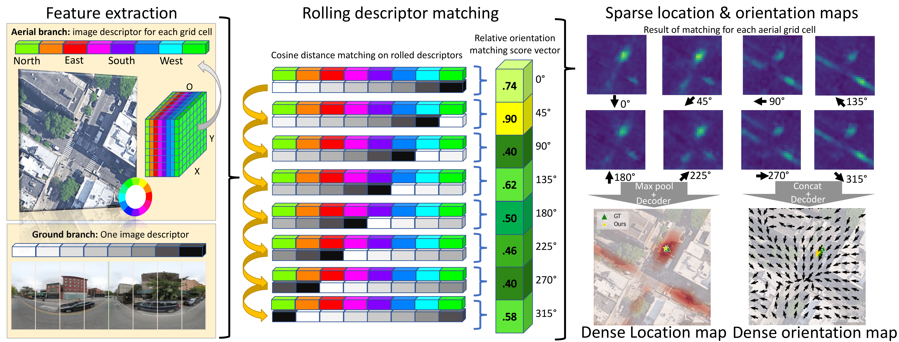

# [T-PAMI'23] CCVPE: Convolutional Cross-View Pose Estimation
[[`Paper`](https://arxiv.org/pdf/2303.05915v2.pdf)] [[`Demo Video`](http://www.youtube.com/watch?v=9p7bccGZ82Q)] [[`BibTeX`](#citation)]

This work is an extension of ["Visual Cross-View Metric Localization with Dense Uncertainty Estimates, ECCV2022"](https://github.com/tudelft-iv/CrossViewMetricLocalization)



Demo video of per-frame pose estimation on Oxford RobotCar traversals with different weather and lighting conditions

[](http://www.youtube.com/watch?v=9p7bccGZ82Q "CCVPE Demo Video on Oxford RobotCar")


Pose estimation (localization + orientation estimation) on images with different horizontal field-of-view (HFoV). From left to right: HFoV= $360^{\\circ}$, $180^{\\circ}$, $108^{\\circ}$

  


### Abstract
We propose a novel end-to-end method for cross-view pose estimation. Given a ground-level query image and an aerial image that covers the query's local neighborhood, the 3 Degrees-of-Freedom camera pose of the query is estimated by matching its image descriptor to descriptors of local regions within the aerial image. The orientation-aware descriptors are obtained by using a translational equivariant convolutional ground image encoder and contrastive learning. The Localization Decoder produces a dense probability distribution in a coarse-to-fine manner with a novel Localization Matching Upsampling module. A smaller Orientation Decoder produces a vector field to condition the orientation estimate on the localization. Our method is validated on the VIGOR and KITTI datasets, where it surpasses the state-of-the-art baseline by 72% and 36% in median localization error for comparable orientation estimation accuracy. The predicted probability distribution can represent localization ambiguity, and enables rejecting possible erroneous predictions.
Without re-training, the model can infer on ground images with different field of views and utilize orientation priors if available. On the Oxford RobotCar dataset, our method can reliably estimate the ego-vehicle's pose over time, achieving a median localization error under 1 meter and a median orientation error of around 1 degree at 14 FPS.

### Datasets
VIGOR dataset can be found at https://github.com/Jeff-Zilence/VIGOR.
We use the revised ground truth from https://github.com/tudelft-iv/SliceMatch <br />
KITTI dataset can be found at https://github.com/shiyujiao/HighlyAccurate <br />
For Oxford RobotCar, the aerial image is provided by https://github.com/tudelft-iv/CrossViewMetricLocalization, the ground images are from https://robotcar-dataset.robots.ox.ac.uk/datasets/

### Models
Our trained models are available at: https://surfdrive.surf.nl/files/index.php/s/cbyPn7NQoOOzlqp

### Training and testing
Training or testing on VIGOR dataset: <br />
samearea split: `python train_VIGOR.py --area samearea` <br />
crossarea split: `python train_VIGOR.py --area crossarea` <br />
For testing, add argument `--training False` <br />
For testing with an orientation prior that contains up to $X^{\\circ}$ noise, e.g. for $[-72^{\\circ}, +72^{\\circ}]$ noise, add the argument `--ori_noise 72`. $X=0$ corresponds to testing with known orientation <br />
For testing with images with a limited HFoV, e.g. $180^{\\circ}$, add the argument `--FoV 180`

Training on KITTI dataset: `python train_KITTI.py` <br />
For testing, add argument `--training False` <br />
For training or testing with an orientation prior, e.g. $[-10^{\\circ}, +10^{\\circ}]$, add argument `--rotation_range 10` <br />
We also provide the model trained with $[-10^{\\circ}, +10^{\\circ}]$ orientation prior, please change the `test_model_path` in `train_KITTI.py`

Training or testing on Oxford RobotCar dataset: <br />
`python train_OxfordRobotCar.py` or `python train_OxfordRobotCar.py --training False`

### Visualize qualitative results
Visualize qualitative results on VIGOR same-area or cross-area test set: <br />
`python visualize_qualitative_results_VIGOR.py --area samearea --ori_prior 180 --idx 0` <br />
`idx`: image index in VIGOR test set <br />
`ori_prior`: $X$ means assuming known orientation with $[-X^{\\circ}, +X^{\\circ}]$ noise, $X=180$ stands for no orientation prior

### Citation
```
@ARTICLE{10373898,
  author={Xia, Zimin and Booij, Olaf and Kooij, Julian F. P.},
  journal={IEEE Transactions on Pattern Analysis and Machine Intelligence}, 
  title={Convolutional Cross-View Pose Estimation}, 
  year={2024},
  volume={46},
  number={5},
  pages={3813-3831},
  keywords={Location awareness;Cameras;Pose estimation;Task analysis;Feature extraction;Image retrieval;Decoding;Aerial imagery;camera pose estimation;cross-view matching;localization;orientation estimation},
  doi={10.1109/TPAMI.2023.3346924}}
```
